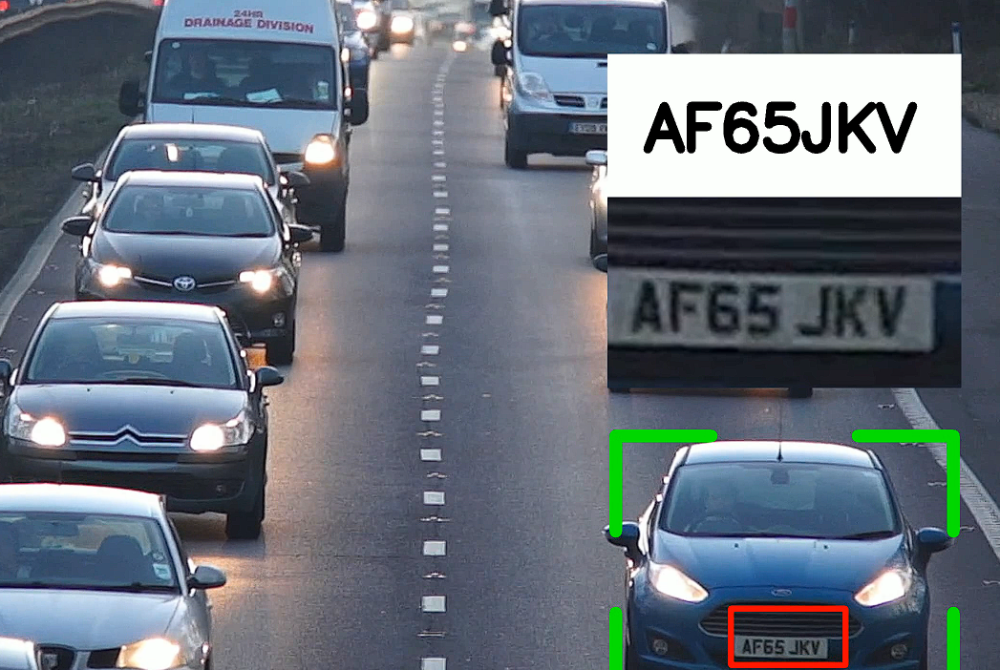

# Number Plate Detection
## Implemented Number Plate Detection using YOLOv8, a state of-the-art object detection model. Leveraged YOLOv8's accuracy and speed for real-time detection of license plates in images and videos.
## Here project demo as simple



## dataset
```bash
https://universe.roboflow.com/roboflow-universe-projects/license-plate-recognition-rxg4e/dataset/4
```

# How to run?
### STEPS:

Clone the repository

```bash
Project repo: https://github.com/
```
### STEPS 01: make models or download from below link

A Yolov8 pretrained model was used to detect vehicles.

A licensed plate detector was used to detect license plates. The model was trained with Yolov8 using [this dataset](https://universe.roboflow.com/roboflow-universe-projects/license-plate-recognition-rxg4e/dataset/4)

The trained model is available in my ```https://drive.google.com/drive/folders/1ZPhloKFfHRpENqEYr7RtVvOywjgwZq2U?usp=sharing ```

## STEP 02: download sort file

The sort module needs to be downloaded from [this repository](https://github.com/abewley/sort)

### STEP 03- Create a conda environment after opening the repository

```bash
conda create -n mchatbot python=3.8 -y
```

```bash
conda activate mchatbot
```

### STEP 04- install the requirements
```bash
pip install -r requirements.txt
```
### STEP 05- Run Project
```bash
python main.py
```
